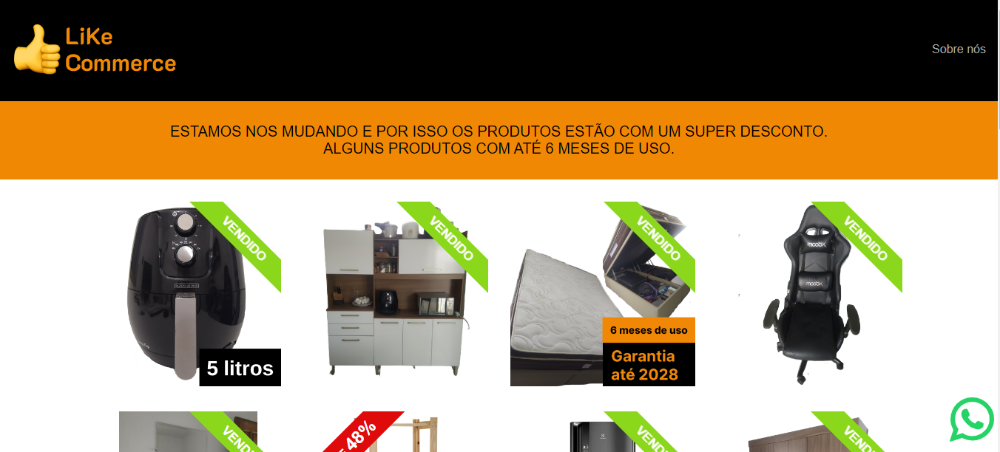

# LikeCommerce

> This project was generated with [Angular CLI](https://github.com/angular/angular-cli) version 17.1.1.

Website: [LiKe Commerce](https://kelwynoliveira.github.io/like-commerce/)

LiKe is the combination of the first syllables of the names Lídia (my wife) and Kelwyn (myself).

We are moving from the northern region of Brazil to the south of the country. And for that, we want to sell the items we won't take with us in the move.

After two weeks with the items available on advertising platforms such as OLX and Facebook Marketplace, we had only a few messages and no deals closed.

This website was developed to promote and sell the items we don't want to take with us in our move.

